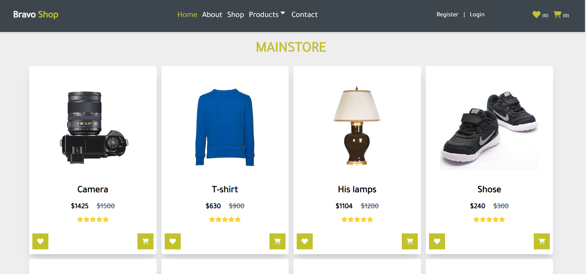
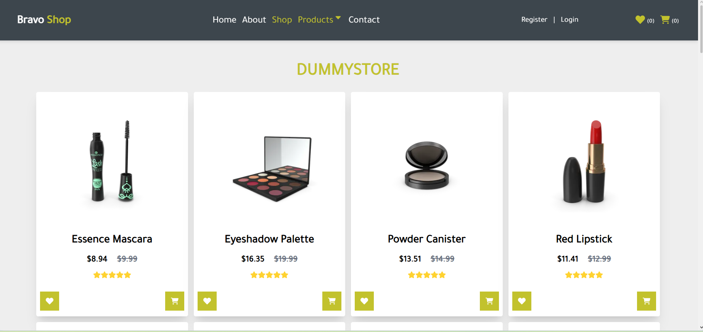
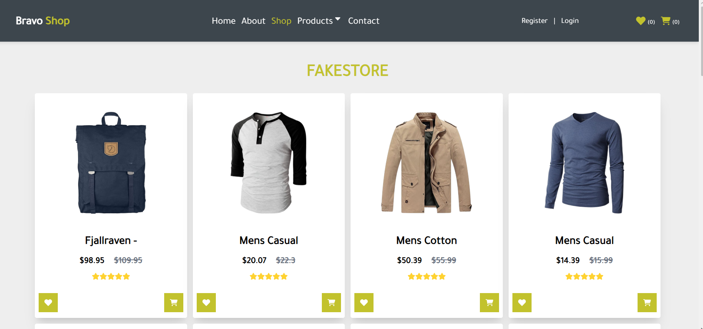
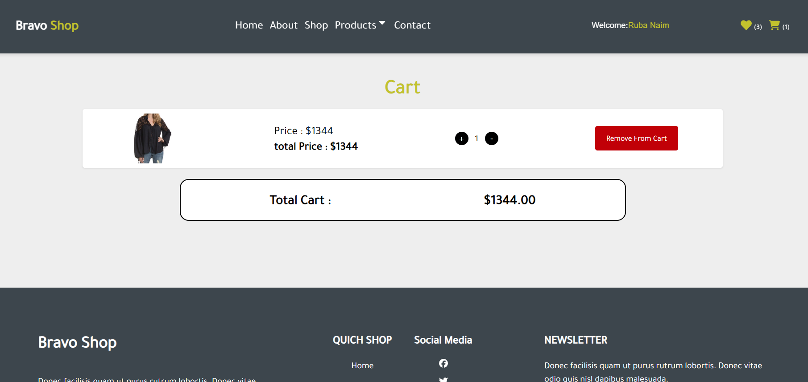
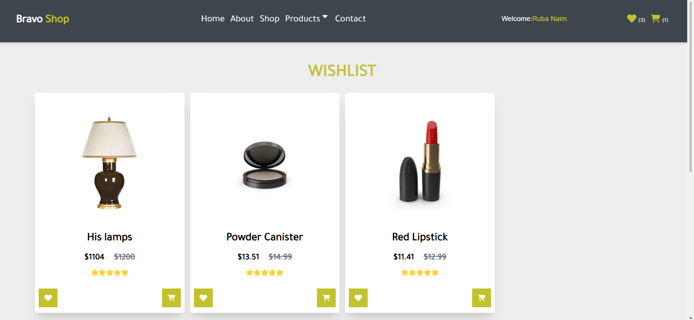
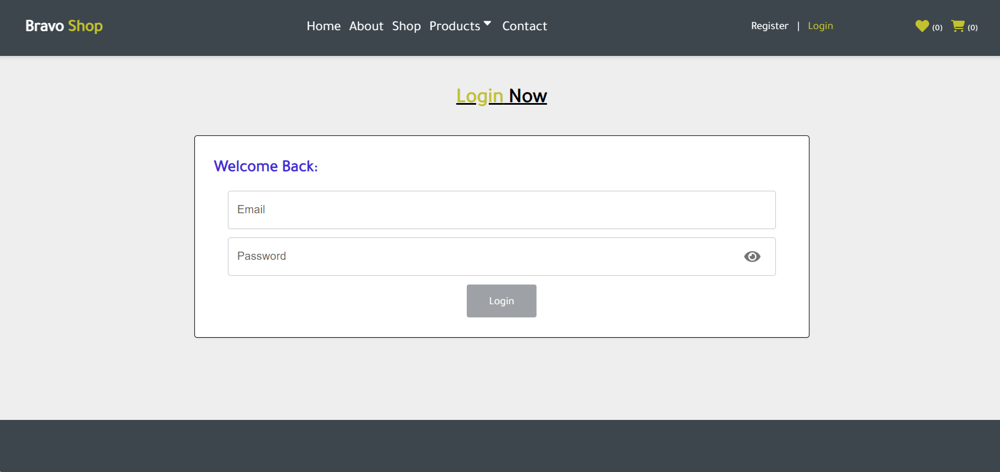
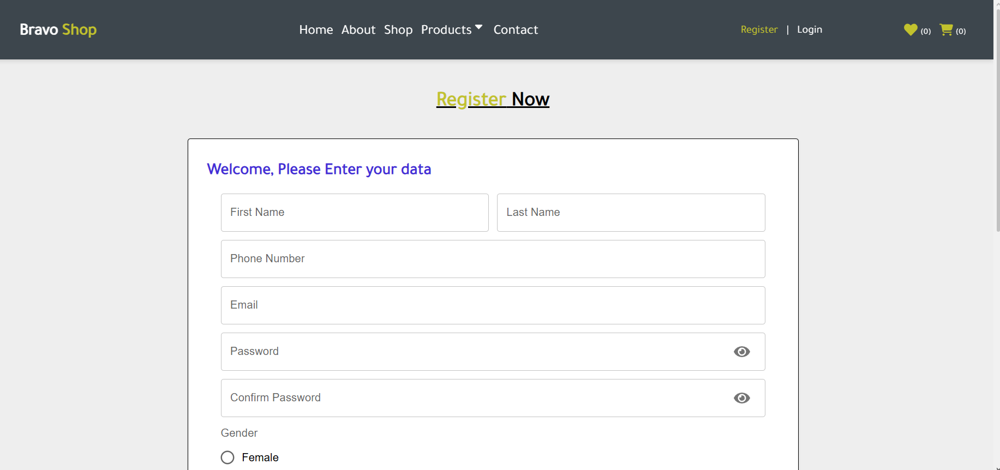

# Bravo Shop

Bravo Shop is a responsive e-commerce web application built with React and Tailwind CSS.  
It allows users to explore products from different store categories, manage a wishlist, and add products to a shopping cart.

---

## Features

### 🛍️ Product Browsing
- Explore products from three categories: Main Store, Dummy Store, and Fake Store.
- Navigate easily between pages using the navbar.
- 8 pages included: Home, About, Shop, Contact, Register, Login, Wishlist, Cart.

### ❤️ Wishlist
- Add products to wishlist using the heart icon.
- View all saved products in the Wishlist page.
- Remove products by clicking the heart icon again.

### 🛒 Cart System
- Add products to cart using the cart icon.
- View all selected products in the Cart page.
- Increase or decrease product quantity.
- Remove products from cart when needed.

### 🔐 Authentication
- User registration and login system.
- Firebase integration for storing registered users' data.

### 📦 Data Management
- Product data is stored in a local `db.json` file inside the backend folder.
- Products are fetched dynamically from the mock database.

---

## Technologies Used

- HTML  
- CSS  
- JavaScript  
- React  
- Tailwind CSS  
- Firebase  

---

## Installation

1. Clone the project from GitHub:

```bash
git clone your-repository-link
```

2. Navigate to the project folder:

```bash
cd app
```

3. Install dependencies:

```bash
npm install
```

---

## Running the Project

### Start the mock database server:

```bash
cd backend
npm start
```

### Start the frontend application:

Open a new terminal:

```bash
cd app
npm run dev
```

Then open in browser:

```text
http://localhost:5173
```

---

## Screenshots

(Add your project screenshots here)

```








```

---

## Project Status

✔ Completed
    
---

## Author

Ruba Naim
## Contact
rubanaim123@gmail.com